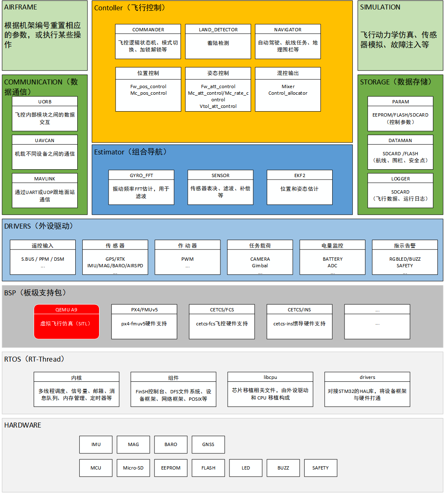

# NextPilot Flight Control System

[English](README.md) | [中文](README_zh.md) | [Español](README_es.md) | [Deutsch](README_de.md)

`NextPilot Flight Control System` is a powerfull, scalable and advanced autopilot, which is designed to be easily used in education, research, and industry.

1. Excellent performance. RTOS based on [RT-Thread V5.0.2](https://github.com/rt-thread/rt-thread/) with active community and rich components, such as FINSH, DFS, ULOG etc.

2. More powerfull. main function ported from [PX4 V1.14.2](https://github.com/PX4/PX4-Autopilot/tree/v1.14.2), which developed by world-class developers from industry and academia, powered all kinds of vehicles from racing and cargo drones through to ground vehicles and submersibles.

3. High scalability. has high-quality scalable software architecture([uORB](pkgs/uorb/uORB.h), [PARAM](pkgs/param/param.h), [AIRFRAME](apps/airframe/README.md)), loose coupling([Automatic initialization mechanism](https://www.rt-thread.org/document/site/#/rt-thread-version/rt-thread-standard/programming-manual/basic/basic?id=rt-thread-%e8%87%aa%e5%8a%a8%e5%88%9d%e5%a7%8b%e5%8c%96%e6%9c%ba%e5%88%b6)), modularity(`a FOLDER, a MODULE FOR a FUNCTION`), is easy to tailor and expand.

4. High efficency. support MATLAB/Simulink [Model-Based Design](https://www.mathworks.com/help/simulink/gs/model-based-design.html), which enable fast and cost-effective development of dynamic systems, including control systems, signal processing systems, and communications systems.

5. Support variety of simulation, such as Model-in-Loop, [Software-in-Loop](bsps/sitl/qemu/README.md), Hardware-in-Loop, [Simulation-in-Hardware](apps/simulation/simulator_sih/sih.cpp).

6. Support most widely used open-source hardware [Pixhawk FMUv5](bsps/px4/fmu-v5/README.md) and hardware [designed by NextPilot](bsps/ndt//README.md).

7. Supports all mainstream compiling tools such as GCC+VScode([Windows](https://github.com/nextpilot/nextpilot-windows-toolchain)/[Ubuntu](https://github.com/nextpilot/nextpilot-ubuntu-toolchain)), Keil and IAR.

## System Architecture

## Supported Vehicle

- Multirotor: quad, six, oct, hex
- Fixed Wing: plane
- Hybrid VTOL: standard, tailsitter, tiltrotor

NextPilot use [airframe]() set Vehicle parameters and start modules.

## Supported Function

### Controller

- Flight Mode: manul, arco, att, alt, pos; takeoff, land, mission, loiter, rtl, follow; offboard
- Safety: geofence, low power, gnss loss, rc loss, datalink loss, engine failure, etc

### Estimator

- Gyro fft:
- Sensor Vote:
- Wind estimator:

### Telemetry

- mavlink
- uavcan

### Simulation

- SITL: qemu + SIH
- HITL: SIH

## Supported Hardware

NextPilot support [PX4 FMUv5](https://docs.px4.io/main/en/flight_controller/cuav_v5_plus.html) open-source hardware，and hardware designed [by NextPilot Develop Team](bsps/ndt/README.md).

- mcu: STM32F765 and STM32F753
- sensors: gnss/gps/rtk, IMU(gyro, accel), baro, mag, airspeed
- actuator: pwm, can
- battery: smart, analog
- radio control: s.bus
- notification: led, tunes, safety_button
- payload:

# Document

## User Manual

[Getting Started](https://docs.nextpilot.cn/manual) | [Flight Mode](https://docs.nextpilot.cn/manual/05.%E5%9F%BA%E6%9C%AC%E6%A6%82%E5%BF%B5/01.%E9%A3%9E%E8%A1%8C%E6%A8%A1%E5%BC%8F/index.html) | [Simulation]()

## Develeop Guide

[Getting Started](https://docs.nextpilot.cn/develop/01.%E5%BF%AB%E9%80%9F%E5%85%A5%E9%97%A8/01.setup-develop-environment.html) | [System Startup](https://docs.nextpilot.cn/develop/03.%E7%B3%BB%E7%BB%9F%E6%A1%86%E6%9E%B6/03.system-startup.html) | [Build Tools](https://docs.nextpilot.cn/develop/01.%E5%BF%AB%E9%80%9F%E5%85%A5%E9%97%A8/%E6%9E%84%E5%BB%BA%E9%85%8D%E7%BD%AE%E7%B3%BB%E7%BB%9F/Kconfig.html)

The main IDE/compilers supported by NextPilot are:

- MDK KEIL
- ARM GCC + VSCode

# License

NextPilt follows the [BSD 3-Clause License](./LICENSE). It's completely open-source, can be used in commercial applications for free, does not require the disclosure of code, and has no potential commercial risk.

# Contribution

If you are interested in NextPilot and want to join in the development of NextPilot and become a code contributor, please refer to the [Code Contribution Guide](.github/CONTRIBUTING.md).

Thanks for the following contributors!

