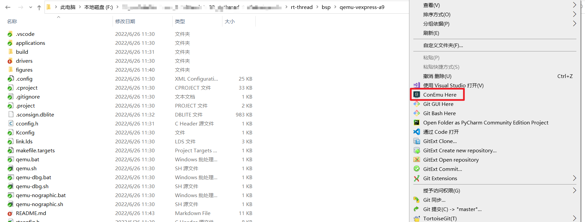
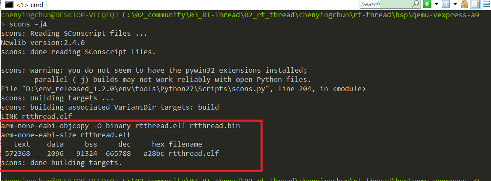
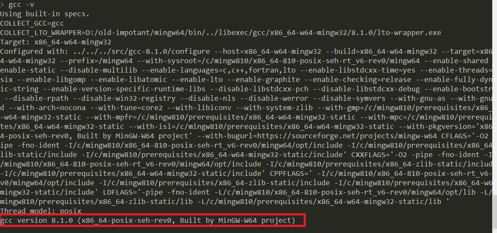

# 基于QEMU虚拟飞行仿真

QEMU/VExpress A9是QEMU模拟器针对ARM VExpress-A9 FPGA开发板进行软件模拟的指令级虚拟机。QEMU/VExpress因为是软件仿真模式，可以配置成多种模式，例如单核Cortex-A9，多核Cortex-A9，以及多核Cortex-A15等。同时也能够模拟出VExpress FPGA开发板上大多数的外设。

NextPilot的虚拟飞行仿真，就是基于RT-Thread的qemu-vexpress-a9进行开发。

|飞机类型|机架编号|多机仿真|故障注入|
|---|---|---|---|
|多旋翼|1102|√|√|
|固定翼|1102|√|√|
|标准垂起|1102|√|√|

## 1 编译固件

- 使用[env工具][2]编译工程，在`sitl/qemu-vexpress-a9`目录中打开env环境，运行命令`scons -j10`



- 如果编译正确无误，会产生rtthread.elf、rtthread.bin文件。在QEMU中一般使用elf方式来运行，所以只需要使用rtthread.elf文件即可。

  

- 当前测试使用的RT-Thread Env版本

  

- 当前测试使用的GCC 交叉编译工具链版本

  

## 2 执行仿真

在当前目录下已经提供了下面几个执行脚本文件，具体的说明如下表所示：

| 执行脚本文件 | 运行平台  |  备注  |
| ------ | ----  | :------:  |
| qemu.bat | Windows | 普通模式启动运行 |
| qemu.sh | Linux | 同上 |
| qemu-dbg.bat | Windows | 调试模式启动运行 |
| qemu-dbg.sh | Linux | 同上 |
| qemu-nographic.bat | Windows | 以不带界面的模式启动运行 |
| qemu-nographic.sh | Linux | 同上 |

编译qemu固件时，条件编译会自动完成以下工作：

- 不编译所有真实的物理设备驱动或程序（比如传感器、遥控器、作动器），仅编译运行框架（uorb、param、logger等）、组合导航（ekf2、sensors等）、飞行控制、飞行模拟等相关模块；

- 将mavlink配置成UDP通信，默认输出端口是14550，输入端口是14551，如果地面站软件开启了监控了14550端口，则能自动连接到飞控；

- 默认启用编号为1102仿真机架，同时启动内置的SIH飞行动力学模拟模块，启动IMU、GPS、MAG、BARO等模拟设备。

> 注意：模拟飞行和真实飞行是同一套代码，只是编译了接入不同的BSP而已，因此模拟飞行和真实飞行的业务逻辑是完全一致的

### 2.1 单机仿真

- 当要执行编译好的`飞控固件`时，在当前目录下运行`env`，在`env`中敲入`qemu.bat`即可直接运行。这个执行脚本默认把串口输出到stdio（即控制台）上，所以直接执行脚本后就可以输出结果了。当然你也可以尝试使用其他两个**.bat**文件启动运行。

- 打开地面站软件，设置地面站自动链接`14550`端口，链接上飞控之后，即可操控地面站，比如：航线规划、起飞着陆、模式切换等等，与真实飞行无而已。

- 在msh提示输入的状态下，按下 **CTRL+C** ，有以下提示之后，按下 **y** ，即可退出 QEMU 。

```shell
msh />
msh />
msh />Terminate batch job (Y/N)? y
```

### 2.4 多机仿真

暂时不是支持

### 2.5 故障模拟

### 2.6 移植仿真

如果希望将飞行仿真移植到其它计算机上，但是又不想安装整套的编译环境和飞控源代码，请如下操作。

- 在新的计算机上安装[Qemu模拟器](https://qemu.weilnetz.de/w64/)，并将`qemu-system-arm.exe`可执行程序所在目录添加到Windows系统的`Path`环境变量中

- 将`编译好的固件`，以及`qemu.bat`等文件文件拷贝到新计算机的任意文件夹中。

- 然后在命令行中运行`qemu.bat`，启动地面站即可正确链接飞控。

## 3 单步调试
