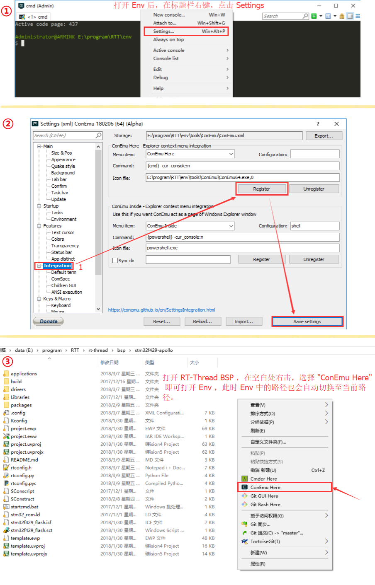
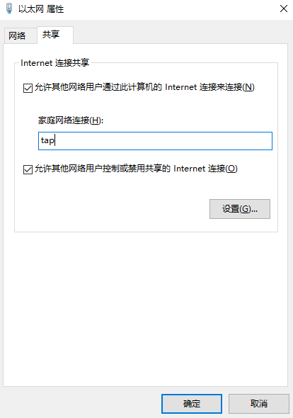

# 搭建开发环境

NextPilot 基于 [RT-Thread](https://www.rt-thread.org/) 实时操作系统进行开发，RT-Thread官方提供了 [Env](https://www.rt-thread.org/document/site/#/development-tools/env/env) 开发辅助工具，提供编译构建环境、图形化系统配置及软件包管理功能。因此不论在 Window 还是 Linux 进行项目开发，都需要 Env 开发工具。

另外RT-Thread 还推出的[RT-Thread Studio](https://www.rt-thread.org/document/site/#/development-tools/rtthread-studio/um/studio-user-begin) **集成开发环境（IDE）**，包含了 Eclipse + Env + Repo等系列工具，RT-Thread Studio 主要包括工程创建和管理，代码编辑，SDK管理，RT-Thread配置，构建配置，调试配置，程序下载和调试等功能，结合图形化配置系统以及软件包和组件资源，减少重复工作，提高开发效率。

[ENV](https://www.rt-thread.org/document/site/#/development-tools/env/env) = [scons（类似CMake的编译工具）](https://scons.org/) + gcc + python + [qemu（仿真模拟器）](https://www.qemu.org/) + ConEmu（类似CMD的命令行终端） + ...

[RT-Thread Studio](https://www.rt-thread.org/document/site/#/development-tools/rtthread-studio/um/studio-user-begin) = eclipse（IDE开发界面）+
[ENV（rt-thread构建工具）](https://www.rt-thread.org/document/site/#/development-tools/env/env) +
ToolChain_Support_Packages（gcc工具链） +
Debugger_Support_Packages（stlink、jlink调试器和qemu模拟器）  +
Board_Support_Packages（bsp） +
Chip_Support_Packages（csp） +
[RT-Thread_Source_Code（rt-thread代码仓库）](https://github.com/rt-thread/rt-thread.git) + ...


**注意：RT-Thread Studio更新会慢一些，部分软件版本偏老，如果对GCC版本有要求的，或者希望了解完整的编译过程，推荐尽量使用ENV！！！**

本项目采用ENV工具链进行开发，关于ENV工具链的[更多资料参考官网](../Z.%E9%99%84%E5%BD%95/X.%E5%BC%80%E5%8F%91%E5%B7%A5%E5%85%B7/env.md)。

## Windows

### RT-Thread Studio（推荐）

我们主要是使用RTT Studio提供的工具链，如st-link调试器等，具体安装过程参考官网文档，**推荐安装在默认路径下，不能包含中文路径**。

### ENV开发工具链（必须）
1、下载[ENV 工具链](https://www.rt-thread.org/download.html#download-rt-thread-env-tool)，然后解压到**不含中文**的目录，比如C:\env-windows-v1.3.5。

2、进入到C:\env-windows-v1.3.5目录，双击运行env.exe，按照下图的方式将ENV.exe添加到右键菜单。


3、后续就可以通过右键菜单启动Env控制台，进行项目的编译、配置等。


4、如果想在普通的Windows终端中使用ENV，那么需要先加载ENV相关环境变量，然后才可以使用scons等命令。
```
call C:/env-windows-v1.3.5/tools/ConEmu/ConEmu/CmdInit.cmd
```
### TAP 虚拟网卡（网络必须）

下载 [tap-windows-9.21.2.exe](https://pan.baidu.com/s/1h2BmdL9myK6S0g8TlfSW0g) 和 [华为IP调试工具IPOP V4.1](http://www.xdowns.com/soft/524006.html)。


1、双击 `tap-windows-9.21.2.exe` 虚拟网卡程序，一路默认安装即可。

2、打开网络和共享中心更改适配器设置，将安装的虚拟网卡**重命名为 tap**（必须），如下图所示：


3、右键当前能上网的网络连接（本文使用以太网），打开属性 -> 共享，选择家庭网络连接为**tap**，点击确定完成设置。也可以将**tap和物理网卡**同时选中，然后右键选择**桥接**，桥接方式需要路由器给RT-Thread**自动分配IP**，否则无法使用。



> 注意：tap 网卡和 VMware 的虚拟网卡可能会冲突，如果出现无法开启网络共享，或者 ping 不通网络的情况，请在禁用 VMware 虚拟网卡之后再尝试一次。或者使用[华为IP调试工具IPOP V4.1](http://www.xdowns.com/soft/524006.html)进行网卡IP绑定或者测试等。

### Git 版本管理（推荐）

在Windows上，下载[Git for Windows](https://gitforwindows.org/)，一路默认安装即可。另外建议安装[TortoiseGit](https://tortoisegit.org/)，该工具提供了git操作的图形用户界面，方便初学者使用。

注意：ENV里面集成了Git for Windows，但是默认只能在env.exe终端才能运行。


## Ubuntu

请使用以下脚本自动安装开发工具链。

### QEMU 模拟器
```shell
sudo apt-get install qemu-system-arm
```

### Scons 编译工具
```shell
sudo apt-get install scons
```

### gcc-arm 编译器

由于apt-get安装的编译器版本太旧会导致编译报错，使用如下命令下载安装新版本。默认安装到/opt/gcc-arm-none-eabi-6_2-2016q4/
```shell
cd /tmp
wget https://armkeil.blob.core.windows.net/developer/Files/downloads/gnu-rm/6-2016q4/gcc-arm-none-eabi-6_2-2016q4-20161216-linux.tar.bz2
tar xf ./gcc-arm-none-eabi-6_2-2016q4-20161216-linux.tar.bz2
mv gcc-arm-none-eabi-6_2-2016q4/ /opt/
/opt/gcc-arm-none-eabi-6_2-2016q4/bin/arm-none-eabi-gcc --version
```

### ncurses 库
```shell
sudo apt-get install libncurses5-dev
```
