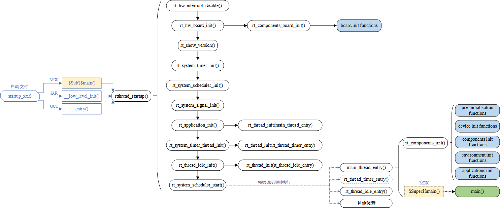

# 启动流程

NextPilot基于RT-Thread实时操作系统，沿用RT-Thread的标准启动流程。同时每个模块保持相对独立，并采用[RT-Thread自动初始化机制](#rt-thread-自动初始化机制)依次启动，在同一个初始化阶段里面`启动函数`的**执行顺序一般由编译顺序确定**。

## 系统启动流程

RT-Thread 支持多种平台和多种编译器，而 rtthread_startup() 函数是 RT-Thread 规定的统一启动入口。一般执行顺序是：系统先从启动文件开始运行，然后进入 RT-Thread 的启动函数 rtthread_startup() ，最后进入用户入口函数 main()，如下图所示：




以 MDK-ARM 为例，用户程序入口为 main() 函数，位于 main.c 文件中。系统启动后先从汇编代码 startup_stm32f103xe.s 开始运行，然后跳转到 C 代码，进行 RT-Thread 系统启动，最后进入用户程序入口函数 main()。

为了在进入 main() 之前完成 RT-Thread 系统功能初始化，我们使用了 MDK 的扩展功能 `$Sub$$` 和 `$Super$$`。可以给 main 添加 `$Sub$$` 的前缀符号作为一个新功能函数 `$Sub$$main`，这个 `$Sub$$main` 可以先调用一些要补充在 main 之前的功能函数（这里添加 RT-Thread 系统启动，进行系统一系列初始化），再调用 `$Super$$main` 转到 main() 函数执行，这样可以让用户不用去管 main() 之前的系统初始化操作。

关于 `$Sub$$` 和 `$Super$$` 扩展功能的使用，详见 [ARM® Compiler v5.06 for µVision®armlink User Guide](http://infocenter.arm.com/help/index.jsp?topic=/com.arm.doc.dui0377g/pge1362065967698.html)。


下面我们来看看在 components.c 中定义的这段代码：

```c
/* $Sub$$main 函数 */
int $Sub$$main(void)
{
  rtthread_startup();
  return 0;
}
```


在这里 `$Sub$$main` 函数调用了 rtthread_startup() 函数，其中 rtthread_startup() 函数的代码如下所示：

```c
int rtthread_startup(void)
{
    rt_hw_interrupt_disable();

    /* 板级初始化：需在该函数内部进行系统堆的初始化 */
    rt_hw_board_init();

    /* 打印 RT-Thread 版本信息 */
    rt_show_version();

    /* 定时器初始化 */
    rt_system_timer_init();

    /* 调度器初始化 */
    rt_system_scheduler_init();

#ifdef RT_USING_SIGNALS
    /* 信号初始化 */
    rt_system_signal_init();
#endif

    /* 由此创建一个用户 main 线程 */
    rt_application_init();

    /* 定时器线程初始化 */
    rt_system_timer_thread_init();

    /* 空闲线程初始化 */
    rt_thread_idle_init();

    /* 启动调度器 */
    rt_system_scheduler_start();

    /* 不会执行至此 */
    return 0;
}
```


这部分启动代码，大致可以分为四个部分：

（1）初始化与系统相关的硬件；

（2）初始化系统内核对象，例如定时器、调度器、信号；

（3）创建 main 线程，在 main 线程中对各类模块依次进行初始化；

（4）初始化定时器线程、空闲线程，并启动调度器。

启动调度器之前，系统所创建的线程在执行 rt_thread_startup() 后并不会立马运行，它们会处于就绪状态等待系统调度；待启动调度器之后，系统才转入第一个线程开始运行，根据调度规则，选择的是就绪队列中优先级最高的线程。

rt_hw_board_init() 中完成系统时钟设置，为系统提供心跳、串口初始化，将系统输入输出终端绑定到这个串口，后续系统运行信息就会从串口打印出来。

main() 函数是 RT-Thread 的用户代码入口，用户可以在 main() 函数里添加自己的应用。

```c
int main(void)
{
  /* user app entry */
  return 0;
}
```

## 自动初始化机制

自动初始化机制是指初始化函数不需要被显式调用，只需要在函数定义处通过宏定义的方式进行申明，就会在系统启动过程中被执行。

例如在串口驱动中调用一个宏定义告知系统初始化需要调用的函数，代码如下：

```c
int rt_hw_usart_init(void)  /* 串口初始化函数 */
{
     ... ...
     /* 注册串口 1 设备 */
     rt_hw_serial_register(&serial1, "uart1",
                        RT_DEVICE_FLAG_RDWR | RT_DEVICE_FLAG_INT_RX,
                        uart);
     return 0;
}
INIT_BOARD_EXPORT(rt_hw_usart_init);    /* 使用组件自动初始化机制 */
```

示例代码最后的 INIT_BOARD_EXPORT(rt_hw_usart_init) 表示使用自动初始化功能，按照这种方式，rt_hw_usart_init() 函数就会被系统自动调用，那么它是在哪里被调用的呢？

在系统启动流程图中，有两个函数：rt_components_board_init() 与 rt_components_init()，其后的带底色方框内部的函数表示被自动初始化的函数，其中：

1.  “board init functions” 为所有通过 INIT_BOARD_EXPORT(fn) 申明的初始化函数。

2.  “pre-initialization functions” 为所有通过 INIT_PREV_EXPORT(fn)申明的初始化函数。

3.  “device init functions” 为所有通过 INIT_DEVICE_EXPORT(fn) 申明的初始化函数。

4.  “components init functions” 为所有通过 INIT_COMPONENT_EXPORT(fn)申明的初始化函数。

5.  “enviroment init functions” 为所有通过 INIT_ENV_EXPORT(fn) 申明的初始化函数。

6.  “application init functions” 为所有通过 INIT_APP_EXPORT(fn)申明的初始化函数。

rt_components_board_init() 函数执行的比较早，主要初始化相关硬件环境，执行这个函数时将会遍历通过 INIT_BOARD_EXPORT(fn) 申明的初始化函数表，并调用各个函数。

rt_components_init() 函数会在操作系统运行起来之后创建的 main 线程里被调用执行，这个时候硬件环境和操作系统已经初始化完成，可以执行应用相关代码。rt_components_init() 函数会遍历通过剩下的其他几个宏申明的初始化函数表。

RT-Thread 的自动初始化机制使用了自定义 RTI 符号段，将需要在启动时进行初始化的函数指针放到了该段中，形成一张初始化函数表，在系统启动过程中会遍历该表，并调用表中的函数，达到自动初始化的目的。

用来实现自动初始化功能的宏接口定义详细描述如下表所示：

|**初始化顺序**|**宏接口**               |**描述**                                    |
|----------------|------------------------------------|----------------------------------------------|
| 1              | INIT_BOARD_EXPORT(fn)     | 非常早期的初始化，此时调度器还未启动         |
| 2              | INIT_PREV_EXPORT(fn)      | 主要是用于纯软件的初始化、没有太多依赖的函数 |
| 3              | INIT_DEVICE_EXPORT(fn)    | 外设驱动初始化相关，比如网卡设备             |
| 4              | INIT_COMPONENT_EXPORT(fn) | 组件初始化，比如文件系统或者 LWIP             |
| 5              | INIT_ENV_EXPORT(fn)       | 系统环境初始化，比如挂载文件系统             |
| 6              | INIT_APP_EXPORT(fn)       | 应用初始化，比如 GUI 应用                      |

初始化函数主动通过这些宏接口进行申明，如 INIT_BOARD_EXPORT(rt_hw_usart_init)，链接器会自动收集所有被申明的初始化函数，放到 RTI 符号段中，该符号段位于内存分布的 RO 段中，该 RTI 符号段中的所有函数在系统初始化时会被自动调用。


## 飞控模块启动顺序

