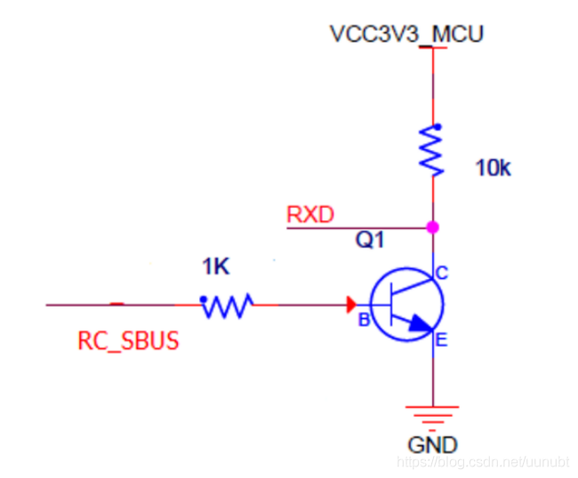

# Futaba S.BUS

## 简介

SBUS，全称Serial Bus，即串行通信总线。广泛应用于航模遥控器（接收机）中，只用一根信号线就能传输多达16通道的数据，比多路PWM捕获高效且省资源。

S.BUS包含S.BUS1和S.BUS2两个版本，其中S.BUS2是S.BUS1的增强版，并兼容S.BUS1。配合S.BUS2传感器，S.BUS2协议可以把温度、电压、电流、高度、加速度、GPS、角速度、转速等回传到遥控器上，不需要增加无线数传模块。S.BUS2和S.BUS1的区别：

1：总线类型不一样。S.BUS1是单向传输，只做控制使用，不做输入。S.BUS2是非标准的双向总线，可以做控制输出，也可以做信息输入。

2：结束符不一样。S.BUS1结束符为0x00。而S.BUS2的结束符为0x04，0x14, 0x24, 0x34之间循环。

3：S.BUS2和S.BUS1的硬件电路不一样。S.BUS2的传感器不能挂载到S.BUS1的总线上，否则会烧坏。

S.BUS2有接收，是个半双工的双向口，**但是Futaba并没有公开数据协议，属于专有协议**，并不通用。因此S.BUS2只支持Futaba自家的S.BUS2协议的传感器作为回传数据，如温度传感器SB-01TE为温度传感器、SB-01V为电压传感器、SB-02RM为电机转速传感器，这些都是可以用来把飞控端的数据传到遥控器上的。

## 串口配置

100k波特率，8位数据位（在stm32中要选择9位），偶校验（EVEN)，2位停止位，无控流，25个字节。

## 硬件标准

S.BUS 采用TTL电平，即3.3V。使用负逻辑，即低电平为“1”，高电平为“0”。也无论接收还是发送都要进行硬件取反（注意：一定要硬件取反，STM32F7系列串口自带有取反功能），电路如下：



## 协议格式

|变量|字节|长度|取值|意义|
|----|----|----|----|----|
|startbyte|0|1|0x0F|起始标志位，固定为0x0F|
|data|1...22|22|x|22个字节共176bit，每11个bit表示一个通道值（低位在前高位在后），共16个通道，取值范围0-2047，基本上是282~1722，中值为1002。但是航模舵机PWM值是1000~2000，中值为1500，因此需要对S.BUS输出进行一个线性映射|
|flag|23|1|x|bit0是第17通道，bit1是第18通道，也就是说17和18通道是一个布尔值。bit2表示frame_drop（也就是遥控器信号不好，存在丢帧），bit3表示failsafe（也就是遥控器关闭或丢失了）
|endbyte|24|1|0x00，0x04，0x14，0x24，0x34等|不同值表示不同的扩展数据，具体见下面说明|

S.BUS1标准协议包含25个字节，起始位是0X0F，结束位是0X00：

`[数据头] [第一个字节] [第二个字节] ......[第二十二的字节] [标志位] [数据尾]`

S.BUS2对v1进行了扩展，根据endbyte确定后续扩展内容，因此S.BUS2结束位不再是`0x00`，而是`0x04，0x14，0x24，0x34`四个数字之间循环，逐次发送0-31号SLOT中的数据。每个SLOT有自己的唯一名字（SLOT_ID）：

```
SLOT_ID = {
 0x03, 0x83, 0x43, 0xC3, 0x23, 0xA3, 0x63, 0xE3,
 0x13, 0x93, 0x53, 0xD3, 0x33, 0xB3, 0x73, 0xF3,
 0x0B, 0x8B, 0x4B, 0xCB, 0x2B, 0xAB, 0x6B, 0xEB,
 0x1B, 0x9B, 0x5B, 0xDB, 0x3B, 0xBB, 0x7B, 0xFB
}
```

SLOT数据由3个字节组成，第1个字节是SLOT_ID，后2个字节是数据，即`[SLOT_ID, DATA1, DATA2]`，每次**最多发送8个SLOT数据，也就是最多24个字节**，但是如果某个SLOT没有数据，则该SLOT不发送，如果8个SLOT都没有数据，就什么扩展数据也不发送了，后续直接是S.BUS1。

```
0x00    表示后续是S.BUS1，也就是18路PWM
0x04    表示发送Slot 0 ~ 7数据，共24字节
0x14    表示发送Slot 8 ~ 15数据，共24字节
0x24    表示发送Slot 16 ~ 23数据，共24字节
0x34    表示发送Slot 24 ~ 31数据，共24字节
```

> 有一个特例，S.BUS2的SLOT0（ID=0x03）默认是接收机电压，不能修改和占用，而endbyte=0x04时表示发送SLOT 0 ~ 7中的数据，因此SLOT0接收机电压在此帧会发送出去。这就是为什么endbyte=0x04的时候，后面必定跟一个0x03 xx xx的小尾巴，这里的0x03表示SLOT0，后面两个xx是接收机电压。

## 注意事项

1. 遥控器关闭之后，S.BUS接收机还是会一直输出数据，但是不同的型号接收机会差异

> 绝大部分接收机是继续输出最后一拍的数据，部分接收机可能会将油门通道的值变成最低，但是一般都会将flag的bit2和bit3设置1，因此为了安全，在监测到bit2和bit3变成1之后，一定要禁用遥控器的控制，否则存在很大安全隐患

## 参考链接

S.BUS2数传库：[https://github.com/BrushlessPower/SBUS2-Telemetry](https://github.com/BrushlessPower/SBUS2-Telemetry)。
