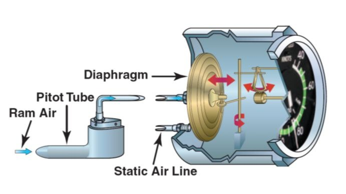
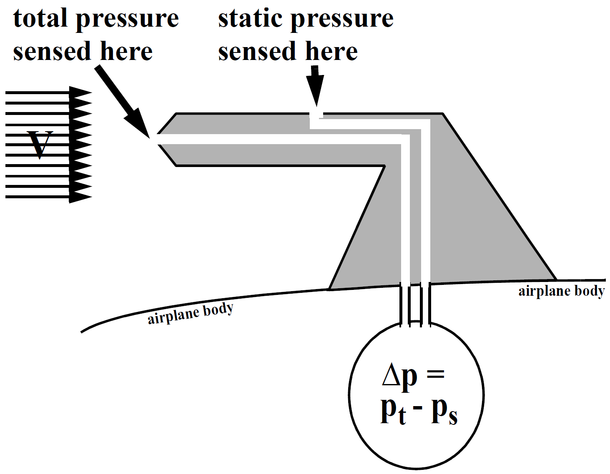
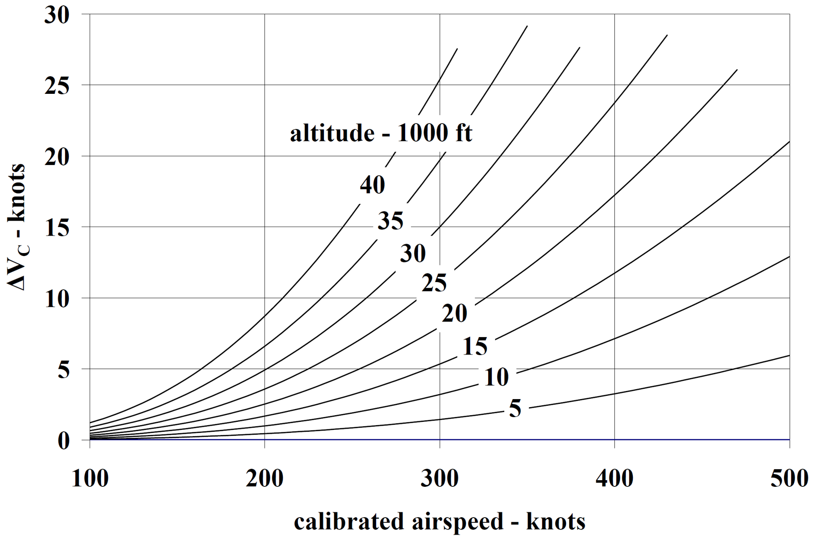
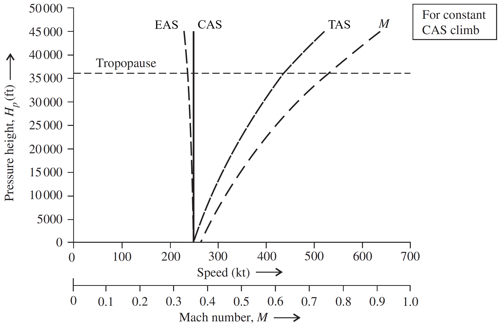

# 各种空速的意义

本文引用自：<https://www.bilibili.com/read/cv16886165/>

在飞行原理、飞行性能、飞行计划、空中领航学、航图、仪表飞行程序等飞行专业课程中，我们经常会遇到飞机的相关飞行速度概念，其中最常见的有指示空速（IAS）、校正空速（CAS）、当量空速（EAS）、真空速（TAS）。特别是IAS、CAS和EAS这三个空速，在飞行性能手册以及相关资料中，有时会同时出现，很多学员顿时就懵逼了。下面我就简单地做一个梳理，希望能帮助学员能够彻底明白这几个空速的概念和区别。

一般各种空速计算过程如下：

- 首先由空速管测量出冲撞压力（总压-静压，注意这不是动压，近似等于动压，冲击压力包含了仪表误差和空气压缩滞止压力等），根据冲撞压力计算指示空速IAS（海平面密度）

- 对冲撞压力进行校准，主要是仪表误差（包括空速管类型、安装位置、空气摩擦力等等），得到校准后的冲撞压力，计算出校准空速CAS（海平面密度）

- 将校准冲撞压力减去由于空气压缩引起的空速管内滞止压力，得到动压，根据动压计算当量空速EAS（海平面密度），表征了飞行空气动力，也就是EAS越大飞机承受的空气动力越大

- 采用当前海拔的大气密度，根据动压计算真空速TAS，表征了飞行相对大气的速度，一般用于计算MACH数

## IAS（Indicated Airspeed，指示空速）

说到IAS，需要先复习一下空速表的基本工作原理：

全压-静压管工作原理

空速表测速原理很简单，就是将皮托管中的总压Pt（Total Pressure，又称为全压、滞止压力）与静压管的静压Ps（Static Pressure）两者进行求差，即ΔP = Pt – Ps，然后将这个压差放在标准海平面上进行计算并在空速表上显示出一个空速值，称为指示空速IAS（Indicated Airspeed）。

$P_{IAS} = P_t - P_s = \frac{1}{2} \rho_0 V_{IAS}^2$

其中，总压和静压的差值ΔP，在一些资料中称为冲撞压力（Impact Pressure），**注意，并不会被称为动压（Dynamic Pressure）**。

指示空速IAS就是空速表所显示出的读数值，因此它常称为表速，意思是飞行员在驾驶舱中空速表上实际看到的空速值。**IAS的大小取决于总压与静压的差值，即冲撞压力**。

**IAS还会受到空速表自身仪表设备误差、皮托管静压孔安装位置误差、气流误差等等的影响，为简单理解，我们这里直接统一称为空速表误差**。空速表可分为机械式和数字式(或电子式)两类，机械式空速表是较早机型上使用的，在机型手册中都会提供空速表误差修正表，以方便飞行人员进行人工修正；数字式空速表是目前主流机型都在使用的，它的仪表设备误差非常小，同时配备ADC（Air Data Computer，大气数据计算机）可以自动修正空速表误差，精度非常高。

## CAS（Calibrated Airspeed，校正空速）

**校正空速CAS是在标准海平面上具有相同冲撞压力(总压与静压之差)时的真空速。也就是说，CAS的大小只取决于总压与静压之差，CAS与IAS之间只差一个空速表误差**。

$P_{CAS} =  P_t - P_s + \Delta P_{err} = \frac{1}{2}\rho_0 V_{CAS}^2$

而现代飞机几乎都配备了数字化仪表，自带ADC（大气数据计算机），自动修正空速表误差，因此飞行员从空速表上读出的IAS与CAS非常接近，几乎是相等的。

飞行员在FCOM上看到的几乎所有速度均为IAS。

## EAS（Equivalent Airspeed，当量空速）

**本质上来说，EAS是在标准海平面上的真空速，它与实际来流的单位体积空气具有相同动能，因此叫做当量空速**。EAS的大小只取决于动压的大小。使用EAS能够方便地计算与分析升力的相关性能，因为在计算飞机的空气动力时，都会用到动压。

飞机的设计限制速度常用EAS表示，例如机动速度VA。不过，为了让飞行员便于参考，在机组操作手册(FCOM)中都会将当量空速EAS根据压力高度条件转换为指示空速IAS。

**由于空气是可压缩的，特别是在马赫数M≥0.4时压缩性明显。考虑空气可压缩性时，动压Pd = 总压Pt – 静压Ps + 仪表误差ΔPerr - 滞止压力ΔPd**，即：

$P_d = (P_t - P_s + \Delta P_{err}) - \Delta P_d = \frac{1}{2}\rho_0 V_{EAS}^2$

其中，多余的ΔPd是由于空气可压缩性所导致的皮托管内滞止压力(总压)增量(**空气与弹簧一样，被压缩时产生反弹力从而使得滞止压力增大**)。空气压缩性越强，ΔPd越大。

对相同来流动压Pd，由于空气的可压缩性使得总压Pt与静压Ps之间的压差增大，即冲撞压力增加，空速表按照冲撞压力计算得出的IAS/CAS会比实际的EAS要大。

如果**不考虑空气可压缩性和空速表误差**，空速表按照总压和静压的压力差测得的读数IAS就等于EAS。

由前面介绍可知，CAS是大于EAS的，即：EAS = CAS – ΔVc，其中ΔVc称为压缩性修正因子，其大小与静压、飞行马赫数有关。高度越高，马赫数越大，则修正因子越大。但特别地，在标准海平面，ΔVc = 0，即CAS = EAS（具体原因涉及到可压缩伯努利方程得到的TAS、CAS和EAS计算公式，这里不再细讲）。下图为ΔVc随CAS和气压高度的变化关系：

压缩性修正因子与CAS和高度的关系

## TAS（Ture Airspeed，真空速）

真空速TAS是最简单、最容易理解的空速，它就是飞机所感受到的相对气流速度。在无风情况下，真空速TAS就等于地速GS（Ground Speed）。

当量空速EAS是在标准海平面上具有相同动压时的真空速TAS，即：

$1/2 \rho_0 V_{EAS}^2 = 1/2 \rho V_{TAS}^2$

其中$\rho_0$为标准海平面上的大气密度，$\rho$为飞机周围的大气密度。

因此，当已知EAS数值以及飞机周围大气密度时，就可以计算出TAS：

$V_{TAS} = \sqrt{\frac{\rho_0} {\rho}} V_{EAS}$

可以知道，高度越高，空气密度越小，TAS就会大于EAS越多。只有在标准海平面上，两者相等。

下图为飞机保持CAS = 250kt从海平面爬升到平流层内时的EAS、TAS和马赫数M变化曲线：(标准大气条件)

几个空速随气压高度的变化关系

可以看到，虽然随着高度的升高，EAS与CAS之间差距逐渐增大，但对于现代民航飞机的飞行速度范围来说，这个差距仅仅不会超过30kt，即差别很小。特别在低速、低空情况下，EAS近似等于CAS。

## 总结

（1）IAS和CAS仅取决于皮托管内总压和静压管内静压之间的差值，即**冲撞压力**，再由标准海平面条件计算得出，即，CAS与冲撞压力之间是一一对应的关系；

（2）IAS与CAS的之间，**只存在空速表误差**，而现代主流机型都使用数字化空速表，配备大气数据计算机ADC，能够自动修正空速表误差（主要为皮托管和静压管位置误差），因此现在的IAS已经做到了无限接近CAS，可以这么理解: CAS是IAS理论上的准确数值，IAS是CAS在空速表上显示的数值(存在非常小的仪表误差)；

（3）**EAS仅取决于动压**（考虑空气压缩性，一般动压小于冲击压力），高于标准海平面时，EAS总小于CAS，且高度越高，两者差距越大，EAS可通过CAS和可压缩性修正因子ΔVc得到。特殊地，在标准海平面上，EAS=CAS=TAS。EAS与动压之间是之间是一一对应关系，即，知道了动压，就等于知道了EAS，反过来，知道了EAS，也就知道了动压，如果又已知飞行高度上的大气密度，那么TAS就可以经过计算得到。

（4）TAS是飞机相对空气的飞行速度，是一个理论值，无法直接测量得到。一般用于计算MACH数。
