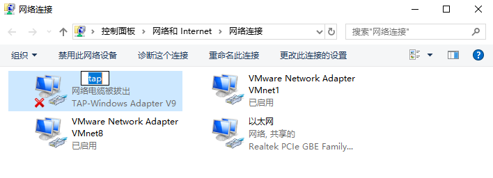

# SIMULATOR仿真

嵌入式软件开发离不开开发板，在没有物理开发板的情况下，可以使用 QEMU 等类似的虚拟机来模拟开发板。QEMU 是一个支持跨平台虚拟化的虚拟机，它可以虚拟很多开发板。为了方便大家在没有开发板的情况下体验 NextPilot，NextPilot，RT 提供了 QEMU 模拟的 ARM vexpress A9 开发板的板级支持包 (BSP)。

本文主要介绍在 Window 平台使用 QEMU 运行 NextPilot 工程，并介绍了如何使用虚拟网卡连接 QEMU 到网络。

## 准备工作
请先完成[开发环境的安装和配置](../A.%E5%BF%AB%E9%80%9F%E5%85%A5%E9%97%A8/1-toolchain.md)

### 安装 TAP 虚拟网卡

1、下载 [tap-windows-9.21.2.exe](https://pan.baidu.com/s/1h2BmdL9myK6S0g8TlfSW0g)，下载好后双击安装程序，默认安装即可。

2、打开网络和共享中心更改适配器设置，将安装的虚拟网卡重命名为 tap，如下图所示：

3、右键当前能上网的网络连接（本文使用以太网），打开属性 -> 共享，选择家庭网络连接为 tap，点击确定完成设置，如下图所示：

注意事项： tap 网卡和 VMware 的虚拟网卡可能会冲突，如果出现无法开启网络共享，或者 ping 不通网络的情况，请在删除 VMware 虚拟网卡之后再尝试一次。