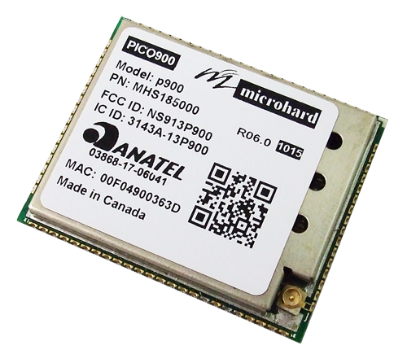
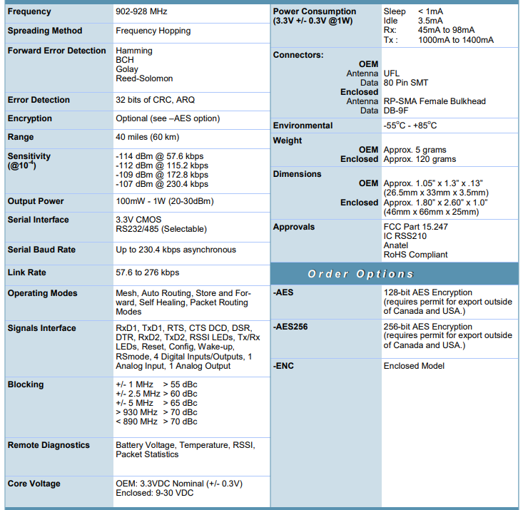
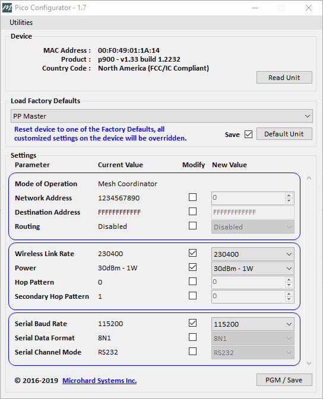
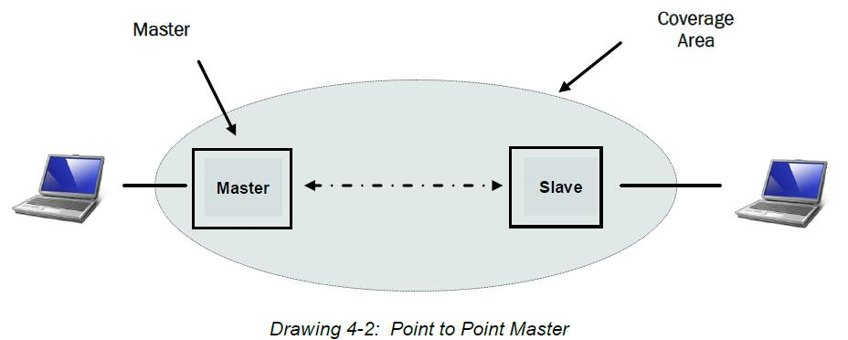
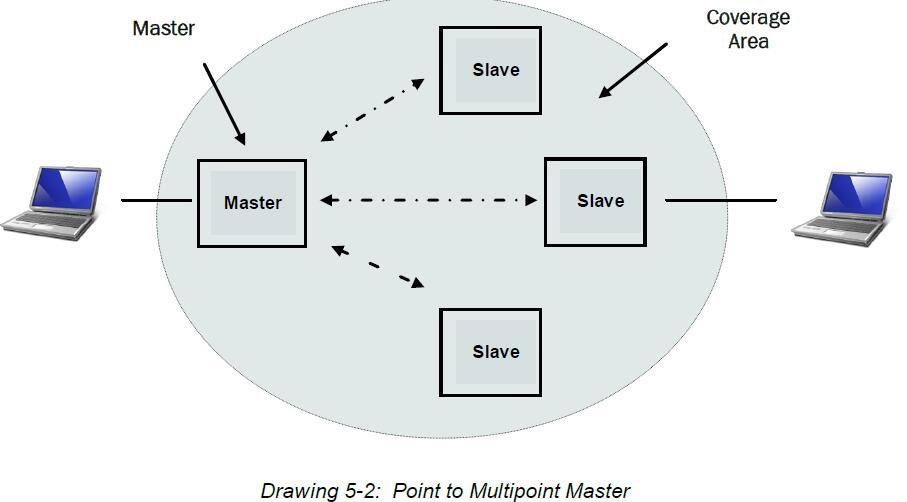

# MicroHard P900



[Microhard Pico系列电台](http://microhardcorp.com/P900.php)集成了P900射频模块。这是一款尺寸相对较小和低成本的无线电台，支持包括点对点、点对多点和网状模式在内的模式。具有可配置的功率输出，也可以配置为forward error correction。



|参数|指标|说明|
|---|---|---|
|频率范围|902-928 MHz|
|发射功率|100mW ~ 1W(20-30dBm)|
|传输距离|40英里（60公里）|
|串口速率|300bps ~ 230kbps|
|无线速率|57.6kbps ~ 276 kbps|

## 电台配置方法

P900 电台详细配置请参考[Pico-Series-P900.Operating-Manual.v1.8.7](./Pico-Series-P900.Operating-Manual.v1.8.7.pdf)。

### 使用 GUI 工具

`PicoConfig.exe`是一个 Microhard P900 图像化配置界面，点击这里下载[PicoConfig-1.7.zip](./PicoConfig-1.7.zip)。



### 使用串口助手

先进入配置模式，串口发送`+++`（注意不需要换行），串口输出`NO CARRIER OK`表示进入COMMAND模式


显示当前配置，串口发送`AT&V`（注意需要换行）


配置网络类型、操作模式、网络地址、单元地址、目标地址、波特率等，一般在预制的`AT&Fx`配置基础上进行修改，比如：

```
AT&F10                # 点对点模式master配置
ATS104=202409081108   # 网络地址，网络地址相同的电台才能通信
ATS105=1              # 单元地址
ATS140=2              # 目标地址
ATS102=1              # 串口波特率
ATS108=30             # 发送功率
```

电台配置好了，需要先保存配置`AT&W`，然后退出配置模式`ATA`，或者直接保存并退出配置`AT&WA`。

## 配置指令列表

> 注意：以下指令除了`+++`不需要换行符，其它所有配置指令都需要在尾部 **增加换行**。

### 常配置指令

|通用指令|作用|
|---|---|
|+++|**不需要换行符**，从DATA进入COMMAND模式，此时可以配置P900|
|ATA|从COMMAND进入DATA模式，正常数据传输|
|AT&V|显示配置|
|AT&W|保存配置|
|AT&WA|保存配置，并退出COMMAND模式|

### 厂家默认配置

|快捷指令|作用|
|---|---|
|AT&F /?|显示默认配置的帮助|
|AT&F1|Mesh Primary Coordinator|
|AT&F2|Mesh Remote|
|AT&F3|Mesh Secondary Coordinator|
|AT&F7|PMP Master|
|AT&F8|PMP Slave|
|AT&F9|PMP Repeater|
|AT&F10|点对点MASTER主节点默认配置|
|AT&F11|点对点SLAVE从节点默认配置|
|AT&F12|点对点Repeater中继默认配置|
|AT&F13|PMP Master 57K|
|AT&F14|PMP Slave 57K|

### 寄存器配置

|寄存器|作用|
|---|---|
|ATSxxx /?|显示xxx寄存器寄存器的帮助|
|ATSxxx=?|查询xxx寄存器的值|
|ATSxxx=x|设置xxx寄存器寄存器的值|
|ATS101=x|操作模式，1主节点Master，2中继Repeater，3从节点Slave|
|ATS102=x|串口波特率，0=230400，1=115200，2=57600，3=38400，4=28800,5=19200，6=14400，7=9600（默认）|
|ATS103=x|无线连接速率，同一个网络中所有节点必须配置相同，1=172800（默认），2=230400，3=57600，4=115200|
|ATS104=x|网络地址，所有通信节点组成一个网络，它们拥有相同的网络地址，换句话说网络地址不同节点之间是无法通信的，为了防止重复建议设置为当前时间，比如202409081022|
|ATS105=x|单元地址，同一个网络中每个电台都身份标识，大部分模式下允许重复，主机默认1，从节点默认2，广播地址65535|
|ATS106=x|Hop pattern|
|ATS108=x|发送功率，默认30（1W）|
|ATS109=x|Hop Interval|
|ATS110=x|串口数据格式，1=8N1（默认），2=8N2|
|ATS133=x|网络类型，0=点对多，1=点对点，2=mesh，3=mesh with roaming|
|ATS140=x|目标地址，数据发送到目标节点的单元地址，点对对模式：主节点设置为2，从节点设置为1|
|ATS159=x|加密模式|

## 点对点模式



### 主节点配置

- ATS133=1，网络类型，必须为 1， 表示点对点模式
- ATS101=0，操作模式，必须为 0，表示点对点模式的主节点
- ATS104=x，网络地址，所有节点保持一致，建议设置为当前时间，比如202409081142
- ATS105=1，单元地址，必须为 1，点对点模式的主节点单元地址必须是1
- ATS140=2，目标地址，一般是2，跟从节点的单元地址保持一致
- ATS103=x，无线连接速率，所有节点保持一致，建议保持默认
- ATS102=x，串口波特率跟电台连接设备保持一致，一般是1，表示115200bps

主节点一般配置指令如下：

```
AT&F10               # 点对点master节点
ATS104=202409081145  # 网络地址，所有节点保持一致
ATS140=2             # 目标地址，一般为2，必须跟从节点单元地址ATS105保持一致
ATS102=1             # 串口波特率，1为115200，2为57600
AT&WA                # 保存并退出
```

### 从节点配置

- ATS133=1，网络类型，必须是1，表示点对点模式
- ATS101=2，操作模式，必须为2，表示点对点模式的从节点
- ATS104=x，网络地址，所有节点保持一致，建议使用当前时间
- ATS105=2，单元地址，一般为2，如果修改为其他，必须同步修改主节点目标地址（S140）
- ATS140=1，目标地址，必须是1，因为点对点模式主节点的单元地址必定是1
- ATS103=x，无线传输速率，所有节点保持一致，建议保持默认
- ATS102=x，串口波特率

从节点一般配置如下：

```
AT&F11               # 点对点slave节点
ATS104=202409081145  # 网络地址，所有节点网络地址ATS104保持一致
ATS105=2             # 单元节点，一般为2，需要同步修改主节点的目标地址ATS140
ATS140=1             # 目标地址，必须1
ATS102=1             # 1为波特率115200，2为57600
AT&WA
```

## 点对点加中继


### 主节点配置

- ATS133=1，网络类型，必须为1， 表示点对点模式
- ATS101=0，操作模式，必须为0，表示点对点模式的主节点
- ATS104=x，网络地址，所有节点保持一致，建议设置为当前时间，比如202409081142
- ATS105=1，单元地址，必须为1，点对点模式的主节点单元地址必须是1
- ATS140=2，目标地址，一般是3，跟从节点的单元地址保持一致
- ATS141=1，是否包含中继，0没有中继，1表示有中继，**只在主节点配置**
- ATS103=x，无线连接速率，所有节点必须一致，建议保持默认
- ATS102=x，串口波特率跟电台连接设备保持一致，一般是1，表示115200bps

主节点一般配置指令如下：

```
AT&F10         # 点对点master
ATS104=202409081145  # 网络地址，所有节点保持一致
ATS105=1       # 单元地址，点对点模式主机单元地址必须为1
ATS140=2       # 目标地址，填写从节点的单元地址（注意不是中继节点的单元地址）
ATS141=1       # 是否包含中继，0没有中继，1有中继，只在主节点配置
AT&WA
```

### 中继节点配置

- ATS133=1，网络类型，必须为1， 表示点对点模式
- ATS101=0，操作模式，必须为1，表示中继节点
- ATS104=x，网络地址，所有节点保持一致，建议设置为当前时间，比如202409081142
- ATS105=3，单元地址，一般为3
- ATS140=1，目标地址，必须为1，因为主节点的单元地址必定是1
- ATS141=1，是否包含中继，0没有中继，1表示有中继，**只在主节点配置**
- ATS106=x
- ATS118=1，漫游地址，一般是1，填写主节点或相邻中继节点的单元地址
- ATS103=x，无线连接速率，所有节点必须一致，建议保持默认
- ATS102=x，串口波特率跟电台连接设备保持一致，一般是1，表示115200bps

中继节点一般配置指令如下：

```
AT&F12         # 中继节点
ATS104=202409081145  # 网络地址，所有节点保持一致
ATS105=3       # 单元地址
ATS140=1       # 目标地址
ATS118=1       # 漫游地址，为主节点或相邻中继的单元地址S105
AT&WA
```

### 从节点配置

- ATS133=1，网络类型，必须是1，表示点对点模式
- ATS101=2，操作模式，必须为2，表示点对点模式的从节点
- ATS104=x，网络地址，所有节点一致，建议使用当前时间
- ATS105=2，单元地址，一般为2，如果修改为则必须同步修改主节点目标地址（S140）
- ATS140=1，目标地址，必须是1，因为点对点模式主节点的单元地址必定是1
- ATS118=3，漫游地址，一般是3，中继节点的单元地址或者65535
- ATS106=x
- ATS206=x
- ATS103=x，无线传输速率，所有节点保持一致，建议保持默认
- ATS102=x，串口波特率

从节点一般配置如下：

```
AT&F11               # 从节点
ATS104=202409081145  # 网络地址，所有节点保持一致
ATS105=2             # 单元地址
ATS140=1             # 目标地址，主节点的单元地址必须是1
ATS118=3             # 中继节点的单元地址
AT&WA
```

## 点对多模式



### 主节点配置

- ATS133=0，网络类型，设置为0，表示点对多模式
- ATS101=0，操作模式，设置为0，表示点对点模式的主节点
- ATS104=x，网络地址，所有节点网络地址必须一致，一般设置为当前时间，比如202409081423
- ATS105=1，单元地址，点对多模式主节点单元节点必须是1
- ATS140=65535，目标地址，点对多模式，主节点设置为65535表示广播给所有从节点
- ATS103=x，无线连接速率，所有节点保持一致
- ATS102=x，串口波特率

```
AT&F7
ATS104=202409081123         # 网络地址，所有节点必须保持一致
ATS140=65535                # 目标地址65535表示广播
ATS102=1                    # 波特率115200
AT&WA                       # 保存并退出
```

### 从节点1配置

- ATS133=0，网络类型，设置为0，表示点对多模式
- ATS101=0，操作模式，设置为2，表示点对点模式的从点
- ATS104=x，网络地址，所有节点网络地址必须一致，一般设置为当前时间，比如202409081423
- ATS105=x，单元地址，从节点单元地址范围2~66634，且不允许重复
- ATS140=1，目标地址，所有从节点都是和master通信，因此为必须设置为1
- ATS103=x，无线连接速率，所有节点保持一致
- ATS102=x，串口波特率

```
AT&F8
ATS104=202409081123         # 网络地址，所有节点必须保持一致
ATS105=2                    # 单元地址，设置为2
ATS102=1                    # 波特率115200
AT&WA                       # 保存并退出
```

### 从节点2配置

```
AT&F8
ATS104=202409081123         # 网络地址，所有节点必须保持一致
ATS105=3                    # 单元地址，设置为3
ATS102=1                    # 波特率115200
AT&WA                       # 保存并退出
```

### 从节点3配置

```
ATS104=202409081123         # 网络地址，所有节点必须保持一致
ATS105=4                    # 单元地址，设置为4
ATS102=1                    # 波特率115200
AT&WA                       # 保存并退出
```

## 常见问题

- Microhard P900最远传输距离是多少？

> 高增益天线，无遮挡可达60公里。

- Microhard P900最小功率和最大功率是多少？

> 最小100mW，最大1W

- Microhard P900空中最小速率和最大速率是多少？

> 最小57.6Kbps，最大276Kbps

- Microhard P900串口最小速率和最大速率是多少？

> 最小300bps，最大230400bps

- Microhard P900工作温度范围是多少？

> -40摄氏度到85摄氏度

- Microhard P900重量是多少？

> 模块重5克，成品重120克

- Microhard P900体积是多少？

> 模块：26.5mm x 33mm x 3.5mm，成品：46mm x 66mm x 25mm

- Microhard P900频率范围是多少？

> 902-928MHz

- Microhard P900如何设置2线RS485？

> 添加ATS142=1，AT&K1这2条指令。硬件连接是：DB9接口的PIN2&PIN7短接作为DATA-；PIN3&PIN8短接作为DATA+，**手册中描述的有问题，不能正常工作**

- Microhard P900如何设置4线RS485？

> 添加ATS142=2，AT&K1这2条指令。硬件连接是：DB9接口的PIN2：TX-；PIN3：RX+；PIN7：RX-；PIN8：TX+

- Microhard P900主板或者盒装品工作电压范围是多少？

> 直流9-30V

- Microhard P900点对多通信的时，如何知道数据是从哪一个电台发给主的？

> 主设置ATS153=1, 启用包头，含从模块的地址。`如接收的数据包00 01 00 F0 49 00 84 82 31
00 01 //数据包长度
00 F0 49 00 84 82 //从模块的MAC地址
31 //数据`

- Microhard P900支持Modbus吗？

> 支持modbus RTU。 设置ATS217=1

- Microhard P900在自己设计的主板上经常出现断开再连接是什么原因？

> 通常是电流不足导致，发射电流需求是1000mA to 1400mA

## 参考链接

- Microhard P900官网：[http://microhardcorp.com/P900.php](http://microhardcorp.com/P900.php)

- 国内代理商技术支持：[http://www.isnmp.com/microhard-p900-resources/](http://www.isnmp.com/microhard-p900-resources/)
