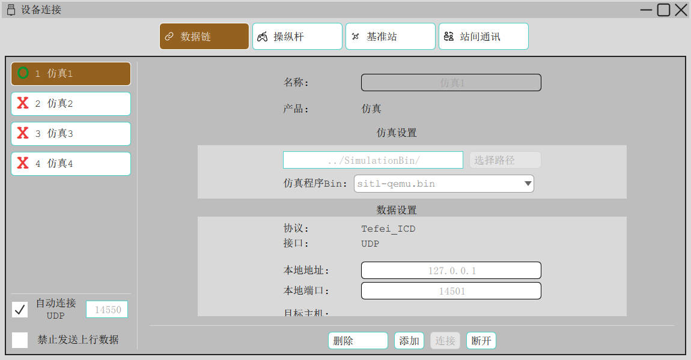
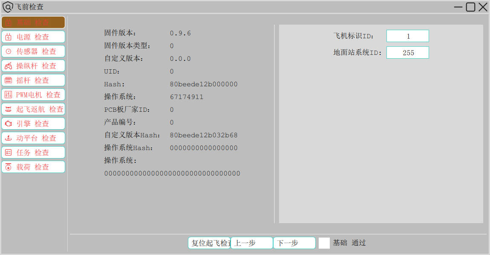
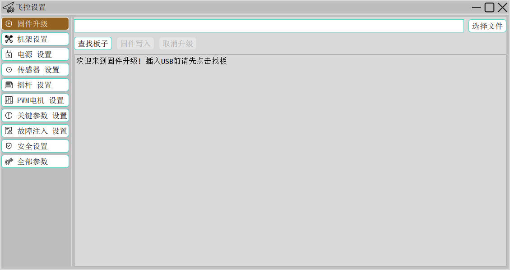
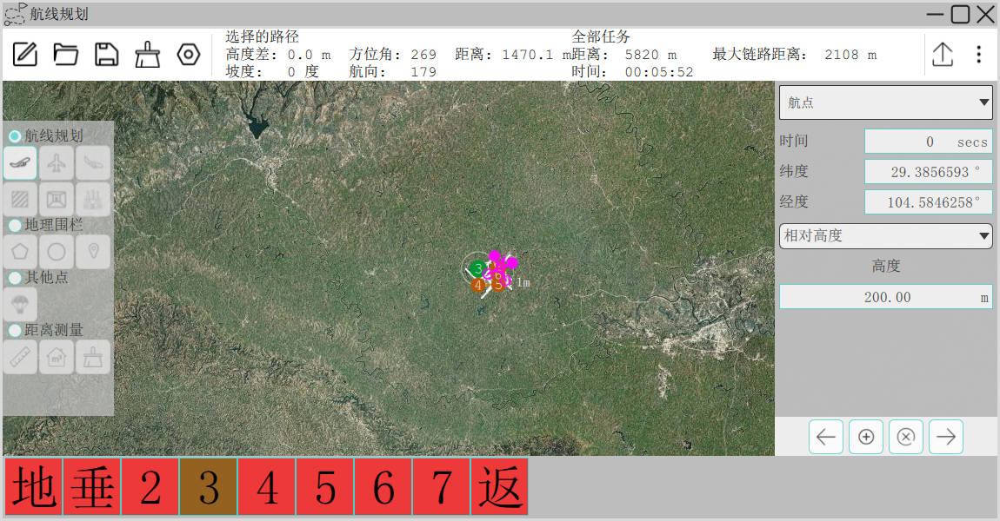
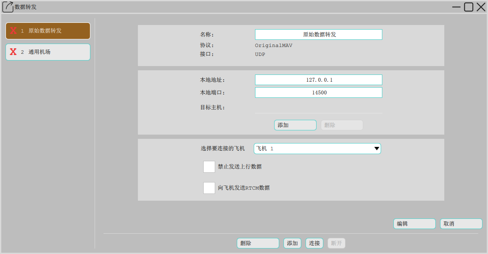
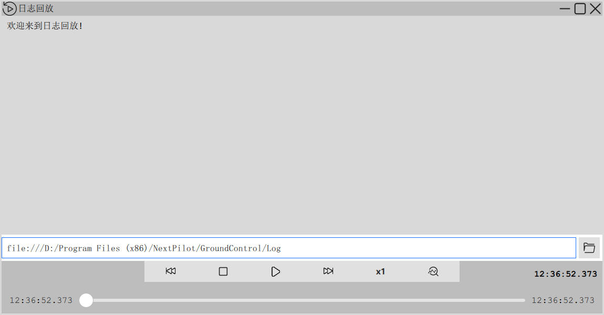
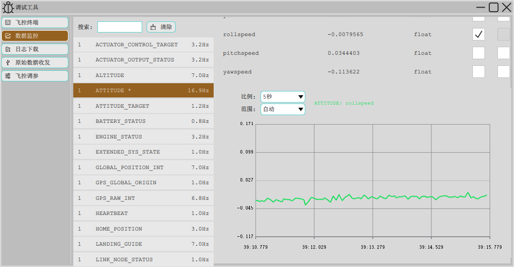
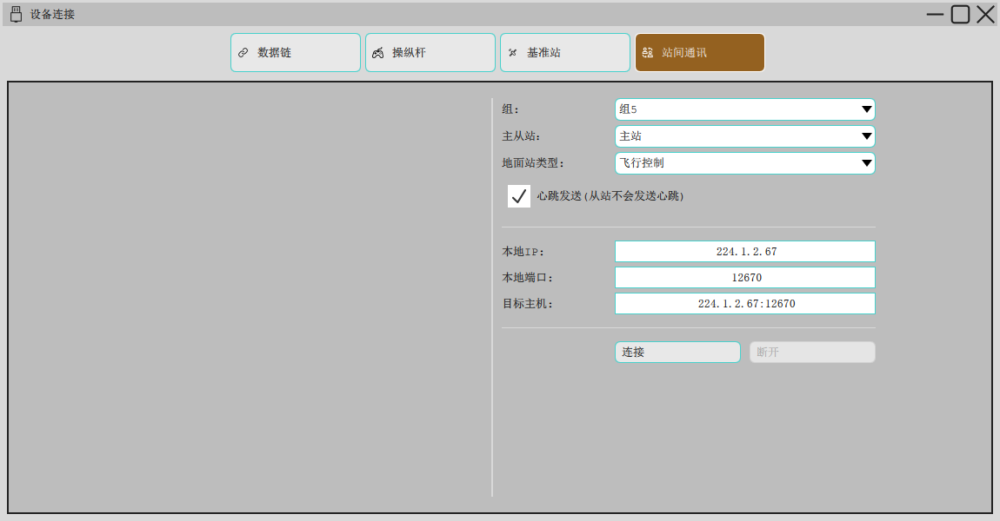
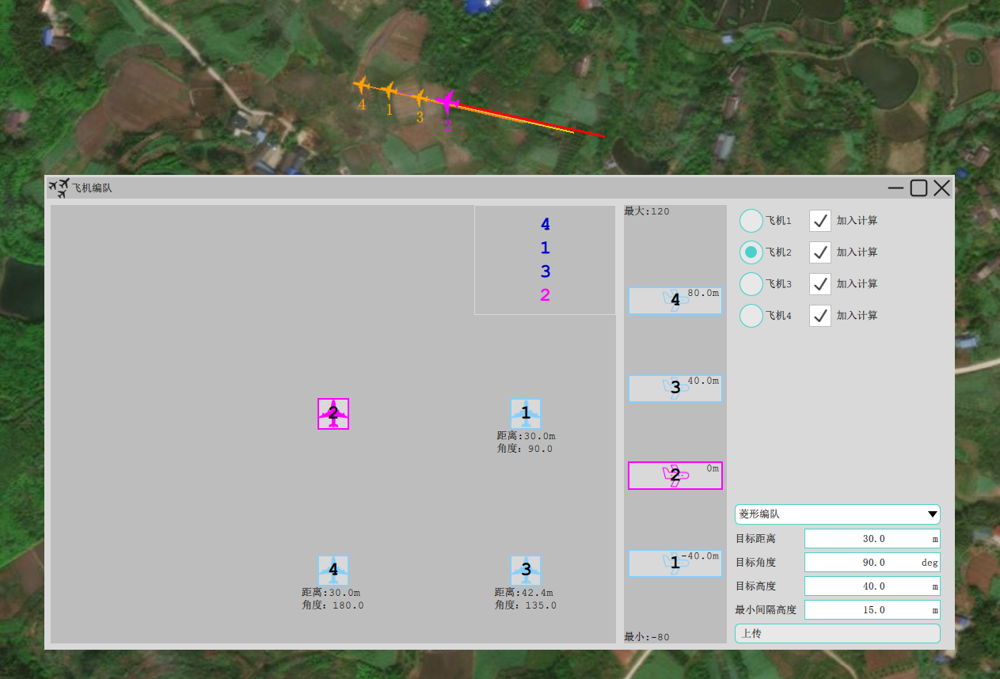

# QGC地面站定制开发

- 精通 C++、QT Quick/QML、javaScript，拥有复杂界面的开发经验；
- 丰富的 GIS 开发经验，熟练 Openlayers 和 QtLocation等；
- 熟悉 MAVLink 协议，具备 QGroundControl 全栈开发能力；
- 负责多款地面站、指控中心软件的开发，并开发多款辅助设计工具。

## 设备连接

地面站支持数据链、遥控器（手柄）、RTK基准站等设备的接入，并可以设置：

- 支持一站多机接入多个数据链，同时监控多架无人机
- 支持Futaba遥控器和游戏手柄接入，通过地面站转发遥控数据控制无人机飞行，使远程控制无人机距离达到几十公里；
- 支持接入RTK基准站，并将RTCM数据、基站位置/速度/航向等信息，通过飞控链路透传给天空端
- **集成一键软件在环仿真（SITL）功能**（地面站集成了飞行动力学模型和飞行控制算法）

特色功能点：

- 支持是否将控制指令转飞无人机，避免误操作
- 支持监控并自动连接指定UDP端口的通信连接
- 支持设置基站的安装位置（基于某原点的相对坐标）

## 飞前检查

## 飞行显控

## 航线规划

独立的任务规划界面，方便用户在多显示屏上进行任务规划，并且我们重新设计了任务规划界面，简化了任务规划逻辑，特别是在复杂航线下的任务规划，增加了一些贴心的小功能，并且在航线规划中并增加了距离测量和面积测量。

在任务规划界面用户可以很清楚直观的查看当前任务的所有详细信息，方便用户对任务进行规划。

> 程序自动判断用户输入的经纬度类型（度分秒或小数点），从而不需要再去手动计算 如：有维度30°48′33.3″ 用户在界面直接输入 30 48 33.3 或小数点 30.8092513程序会自动转换为度分秒进行呈现，方便用户快捷输入。

## 辅助工具

### 数据转发

数据转发功能，可以将地面站收到`遥测数据`，按照 `指定协议` 转发给 **某个IP**，同时能够接收来自 **该IP** 的遥控指令，该功能有如下作用：

- 远程实时监控，将无人机实时飞行数据到远程服务器，可让用户远在千里之外也能实时监控无人机飞行并控制无人机的飞行或任务
- 远程技术支持，将 **遥测数据** 透传到 NextPilot的服务器，技术团队就可以远程看到、操控或调试您的无人机
- 连接指挥大厅，在指挥中心态势图上显示无人机状态，并接受来自指挥大厅的遥控指令（**可以屏蔽远程指令**）

### 日志回放

日志回放是故障分析的重要手段，日志记录要求全面并能够驱动地面站进行回放：

- 记录并回放，地面站所有输入和输出原始二进制数据
- 记录并回放，鼠标所有操作行为（鼠标位置和点击等）
- 记录并回放，地面站软件运行日志
- 支持加速/减速回放，并支持拖拽
- 支持按照飞行起落/启动地面站等方式创建日志文件夹
- 支持按照日期、大小或个数等方式自动清理日志记录
- 支持从遥测数据中提取飞行日志数据
- 支持从遥控数据中提取地面控制指令

### 调试工具

调试工具是一些开发使用的高级功能，包括：

- MAVLink Inspector（遥测监控），用于显示收到的MAVLink消息、频率、字段，并绘制曲线
- MAVLink Console（飞控终端），嫁接在MAVLink协议上的飞控shell控制台，可以用命令行控制飞控
- PID Tune（飞控调参），用于 px4 飞控的角速率控制、姿态控制和位置控制的 PID 调参，能够记忆、恢复、微调 PID 参数

## 特色功能

### 多站一机

多地面站可同时监控无人机，站间可进行数据通讯；根据地面站角色（飞行控制、任务规划、载荷控制和指挥控制）获得不同操作权限，多地面站同时工作减轻地面站操作人员操控压力。

### 编队控制

无人机协调编队飞行，可展示当前飞行编队队形，并可通过飞行编队界面对飞行队形进行设置与编辑等操作。

